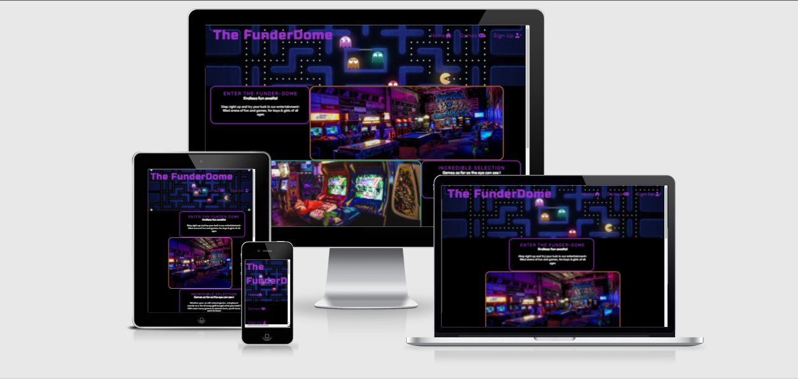
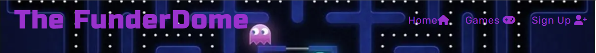
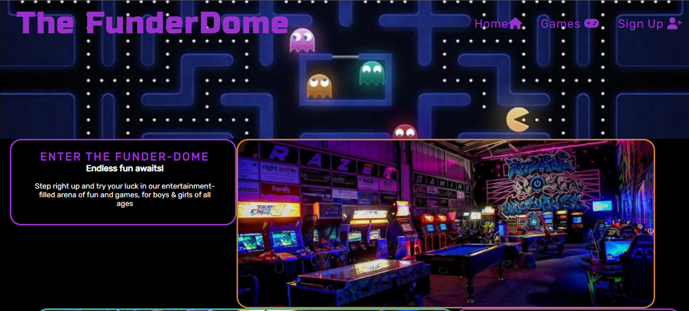
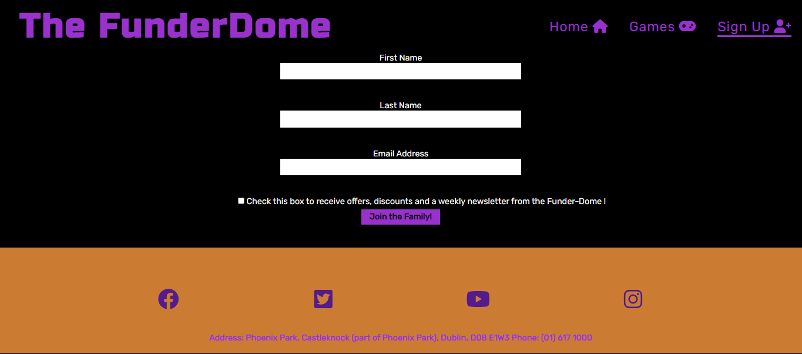

# The FunderDome

The FunderDome is a gamers paradise featuring everything from retro video games to online and local  multi-player video games and even a crazy golf course. This website is targeted at families, gamers and crazy golf enthusiasts of all ages and seeks to create a hub for the local gaming community. This is achieved by showcasing all the games on offer with a simple, uniform and eye-catching design and layout.

## Features

### Existing Features
 *  **Navigation Bar**

    * Featured on all three pages, the full responsive navigation bar includes links to the Logo, Home page, Games section and Sign Up page and is identical in each page to allow for easy navigation.

    * This section will allow the user to easily navigate from page to page across all devices without having to revert back to the previous page via the ‘back’ button. These links are highlighted when hovered over creating improved visibility and a visual call to action.

    

*   **The landing page image**

    * The landing page includes a photograph of a well known retro arcade game to grab the users attention, allowing the user to instantly recognise what the site relates to. 
    
    * The landing pages contains 3 short sharp sections: an Introduction to the site and company, Selection notification section and a Community Membership and offers notification section.

    

*   **The Footer**

    * The footer section contains links to social media platforms for the FunderDome and can help the user stay connected via popular social media platforms. 
    
    * These links are highlighted when hovered over creating improved visibility and a visual call to action. Additionally included is the business address.

*   **Games page**

    * The Games page provides the user with a more in-depth overview of the wide variety of games on offer with accompanying images of the various game types for visual interpretation. 
    
    * This includes a retro arcade games section, a local or online multi-player games room and a 18 hole crazy golf course.

*   **Sign Up Page**

    * This page allows users to sign up to the FunderDome membership community. 
    
    *   The user will be asked to submit their full name and email address and select whether or not they wish to receive news and offers updates by email.

        

### Features Left to Implement

*   **Menu Page for food and drinks options**

## Testing

I opted for a simple layout and easily recognisable and accessible colour palette/scheme that would fit the retro gaming feel of the business.

I have tested all logo, nav bar and footer links and they are working as they should. The sign up form allows the user to submit full name and email address and is prompted if fields not filled or no email address recognised before submission. The checkbox is optional and I used the formdump link to post the entered information to the server for back edn purposes and review.

The website seems responsive on all the sizes stated in the media queries in style.css although there is certainly room for further inprovement and fine tuning. On desktop/laptop screens text and images vary diagonally but on tablets and mobile I opted for a more centered approach to avoid major styling issues and user confusion.

### Validator Testing

#### **HTML**
    
* No errors were returned when passing through the official [W3C validator](https://validator.w3.org/nu/#textarea)

[index.html validation](assets/images/indexhtmlvalidator.PNG)

[games.html validation](assets/images/gameshtmlvalidator.PNG)

[signup.html validation](assets/images/signuphtmlvalidator.PNG)

#### **CSS**

* No errors were found when passing through the official [(Jigsaw) validator](https://jigsaw.w3.org/css-validator/validator)

[css validation](assets/images/cssvalidator.PNG)

### Unfixed Bugs

The footer strays from the right hand side of the webpage at 484px wide and would need to be further assessed and resolved.

## Deployment

*  **The site was deployed to GitHub pages. The steps to deploy are as follows:**
    * In the GitHub repository, navigate to the Settings tab
    * From the Code and Animation section, select the Pages option
    * From the Source section drop-down menu, select the Main Branch
    * Once the Main Branch has been selected, the page will be automatically refreshed with a detailed ribbon display to indicate the successful deployment.
    * The live link can be found here - https://dan-66.github.io/portfolio-project-1/

## Credits

Some of the content and layout ideas were inspired by the Love Running project. Supplementary information and troubleshooting was gathered via [W3 Schools](https://www.w3schools.com/) and [stackoverflow](https://stackoverflow.com/).

### Content
The text for the Home page was taken from [Google Fonts](https://fonts.google.com/)

The icons in the nav bar and footer were taken from [Font Awesome](https://fontawesome.com/)

### Media
The images used on the Home Games and Sign Up pages are from the below sites:

[The Boston Globe](https://www.bostonglobe.com/2021/05/30/lifestyle/luxury-indoor-mini-golf-is-coming-seaport/)

[Arcade 1 Up](https://arcade1up.com/)

[Worlds Of Warcraft](https://worldsofwordcraft.wordpress.com/2014/09/05/king-of-kong-arcade-gaming-culture-vs-modern-gaming-culture/)

[Trip Advisor](https://www.tripadvisor.co.uk/Attraction_Review-g503982-d21143764-Reviews-The_Arcade_Warehouse-Scunthorpe_Lincolnshire_England.html)

[Arcade Club](https://www.arcadeclub.co.uk/games/buggy-boy/)

[Peer Space](https://www.peerspace.com/pages/listings/5bf8acaec66f39001d21c14a)

[Wallpaper Abyss](https://wall.alphacoders.com/by_sub_category.php?id=170006&name=Pac-Man+Fondos+de+pantalla&lang=Spanish)
